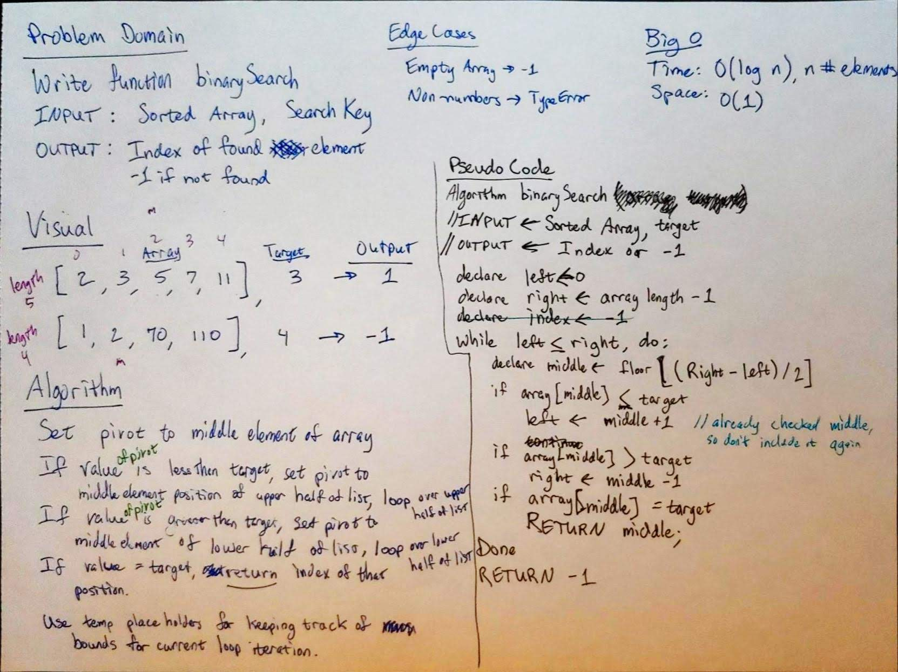
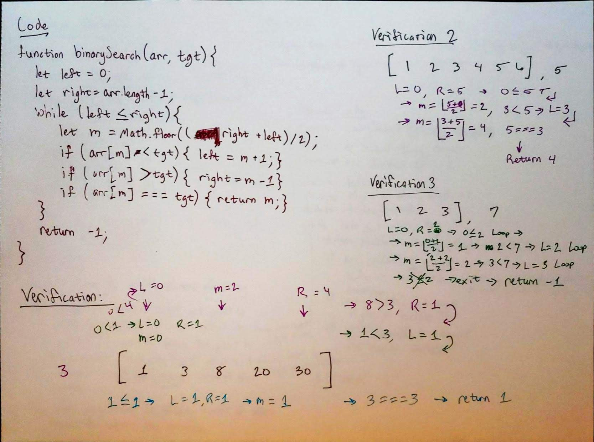

# arrayBinarySearch
This is a function which uses the binary search algorithm to find an element in a sorted numerical array.

## Challenge
Write a function called `BinarySearch` which takes in 2 parameters: a sorted array and the search key. Without utilizing any of the built-in methods available to your language, return the index of the array’s element that is equal to the search key, or -1 if the element does not exist.

## Approach & Efficiency
### Algorithm
- Use pointers to keep track of the segment of array being looped over
- Set L to 0, R to index of last element in array
- Loop for as long as L is less than or equal to R (If L is equal to R, it's a 1-element list and needs to be checked still)
- In each loop iteration:
  - Get the middle element of the array segment being looked at with Math.Floor((L + R) / 2)
  - If middle element is less than target, set L to middle + 1 (don't need to check that element ever again, so don't include it)
  - If middle element is greater than target, set R to middle - 1 (same expl. as above)
  - If middle element is equal to target, return that index
- If you exit the loop, return -1 because the procedure above never found an index and the item isn't in the list.

### Efficiency
- Time: O(log n)
- Space: O(1)

## Solution

