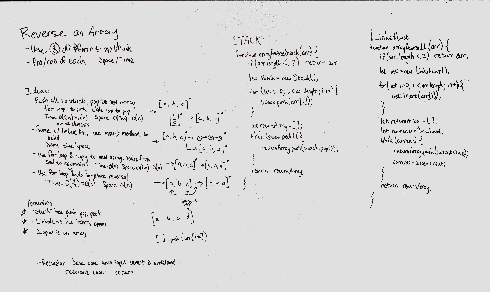

# Multiple Array Reversal Methods
Find 2+ ways to reverse an array

## Challenge
Find at least 2 different ways to reverse an array. Consider the time and space implications of each method.

## Approach & Efficiency
### Algorithm
- Stack
  - Loop through the array from first element to last, pushing each element onto a stack. Once the array is processed, create a new array of the same size and pop each element off the stack, pushing each one onto the array.
  - Time: O(2n) = O(n), where n is the number of elements in the array
  - Space: O(3n) = O(n), where n is the number of elements in the array
- LinkedList
  - Loop through the array from first element to last, inserting each element at the front of a LinkedList. Once the array is processed, create a new array of the same size and traverse the linked list, pushing each value onto the output array.
  - Time: (same as above) O(n)
  - Space: (same as above) O(n)
- Reverse In Place
  - Loop through the array from the first element to the middle element. Using a for loop, copy the current element with the element at index (length - currentIndex - 1). Stop at index just before the middle. Math.floor((length / 2 - 1) should do it.
  - Time: O(n/2) = O(n), where n is the number of elements in the array
  - Space: O(1), because nothing new is created
- Array.reverse() - JavaScript builtin implementation.
  - Time/Space - Unknown, depending on engine implementation
- Recursive method
  - Base case: stop when passed in index -1
  - Start at the 'middle' = Math.floor((length / 2 - 1) and swap element i and element (length - 1 - i) (preassign this index in the function signature).
    - Recurse on current array, and index - 1.
  - Time: O(n), n is number of elements in array
  - Space: O(1) or O(n^2), depending on whether the language in use is smart enough to use a reference to the array or if it copies it in memory.

## Solution

