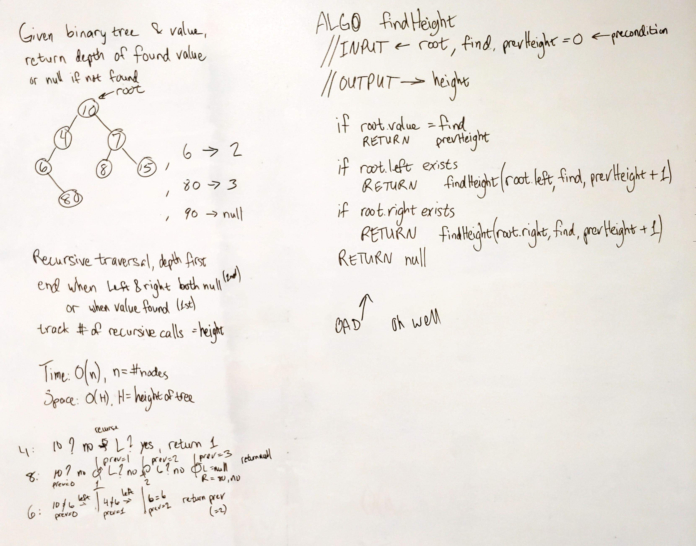
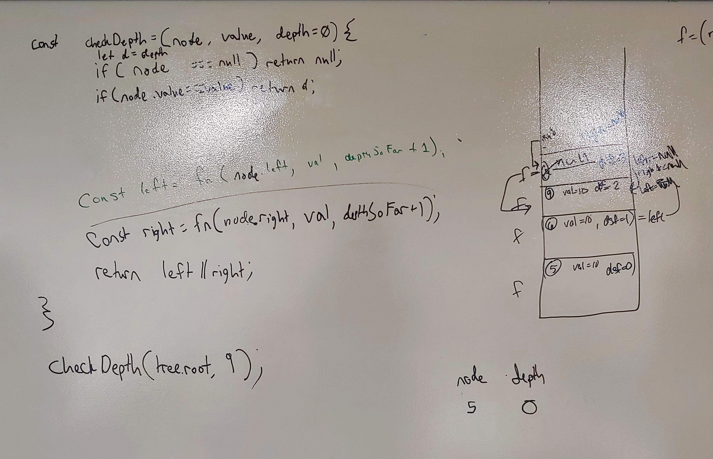
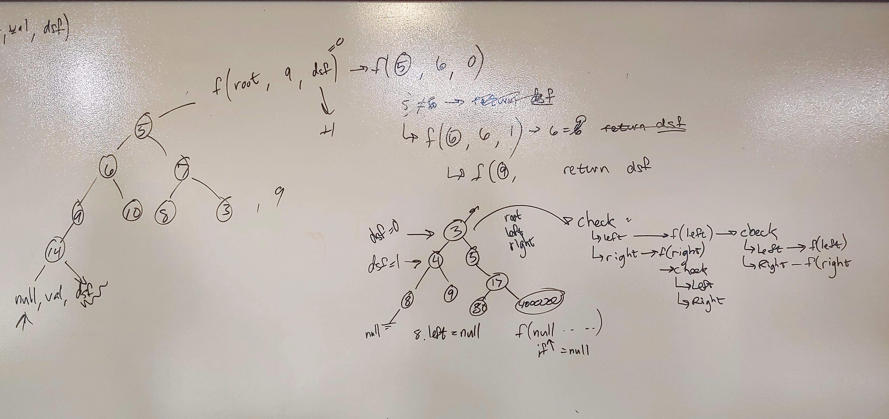

# Binary Tree Depth
Given a binary tree and a value to find, return the depth of the found node.

## Challenge
Find a given value in the tree, then return the depth of that node, meaning the number of links between the tree root and the found node.

## Approach & Efficiency
- Use depth-first recursive traversal
- Keep track of the number of recursions - this is the depth of a found node
- Base conditions to end recursion: when current node is null, return null; when search value is found, return the depth, meaning the number of recursions.

## Solution

