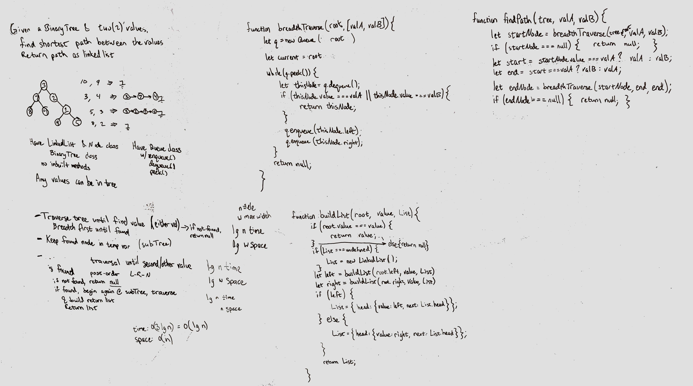

# Binary Tree - Shortest Path

Given a binary tree and two values in the tree, find the shortest path between the two nodes

## Challenge

With a binary tree, find the shortest path between two given nodes.

- The values may be anything at all.
- If a value is not present, return null.
- If the values are not in the same subtree, return null.

## Approach & Efficiency

### Approach
- Use a breadth first traversal to find if a value exists. 
  - If value (either one) is not found, return null.
  - If a value does exist, return the node and use that node's subtree to find if the second value exists.
- If second value exists, use recursion to travel from the first node to the second node, then return a linked list back up the recursive stack. 

### Efficiency
- Breadth-first traversal:
  - Time: O(n), where n is the number of nodes.
  - Space: O(W), where W is the max width of the tree.
- Depth-first traversal:
  - Time: O(n), where n is the number of nodes.
  - Space: O(lg n), where n is the number of nodes.
  
**Total Efficiency**
- Time: O(n), where n is the number of nodes
- Space: O(lg n), where n is the number of nodes

## Solution

