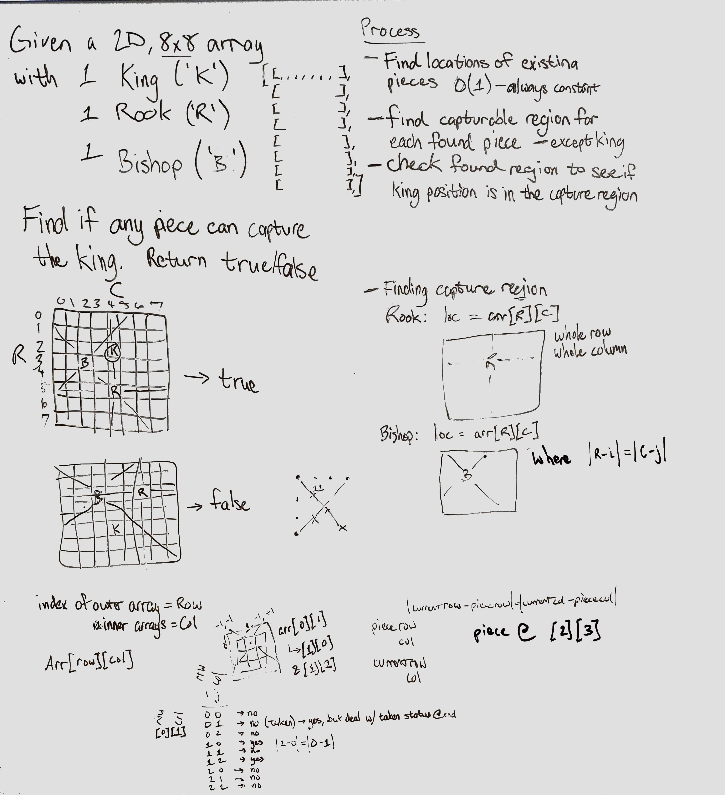

# Checkmate Problem

Check if a given chess board (given as a 2D Array) is in a checkmate state.

## Challenge

Write a function to determine if a chess board, given as a 2D array, has a king which can be captured by the other pieces on the board. To constrain the problem, there are only two other types of pieces on the board, two of Queen, Bishop, Knight, or Rook.

## Approach & Efficiency

- Start with a 2D array mirror of the chess board, with everything set to 0 or true, or something that lets us know a space is not in danger.
- Loop over the board to find where the pieces are.
  - At each found piece, check the capture region for that piece, alter the mirror array, setting the appropriate spaces in the output as 1 or false, or something to let us know the space is in danger
  - Once the king is found, save that coordinate to somewhere we can access later
- Check the king's position in the mirror array. If it's a space in danger, the king can be taken

## Solution

