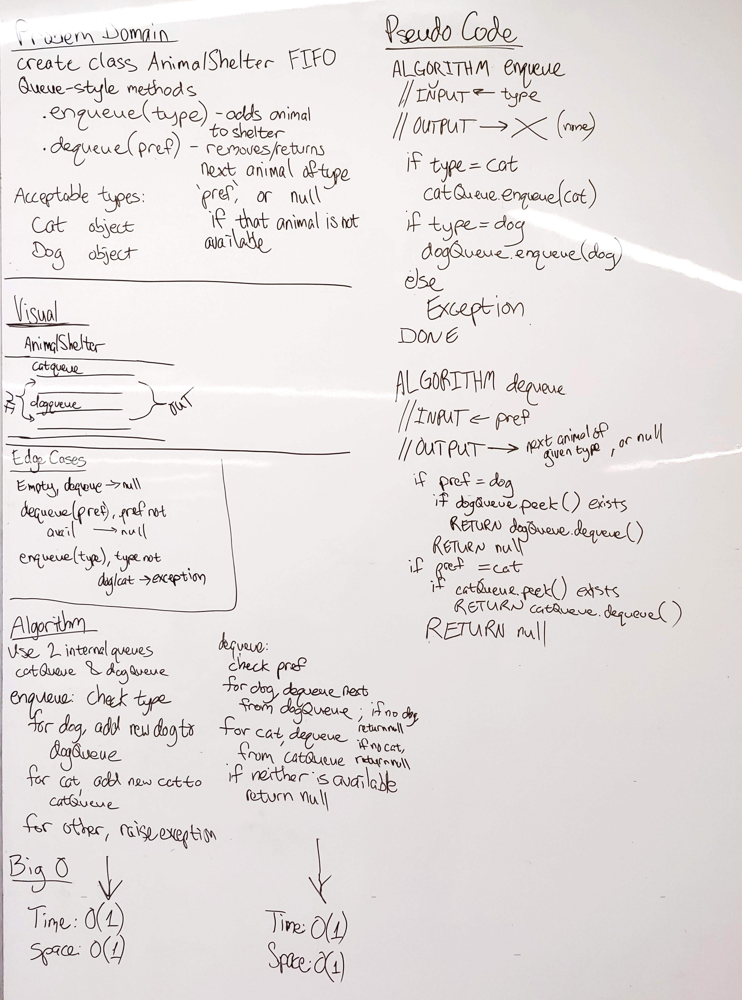

# FIFO Animal Shelter
First-in, First out Animal Shelter.

## Challenge
Create a class called AnimalShelter which holds only dogs and cats. The shelter operates using a first-in, first-out approach.

Implement the following methods:
- `enqueue(animal)`: adds animal to the shelter. animal can be either a dog or a cat object.
- `dequeue(pref)`: returns either a dog or a cat. If pref is not "dog" or "cat" then return null.

## Approach & Efficiency
This approach uses two internal queues, one for cats and one for dogs.
When queueing, check the type of animal being queued and add it to the appropriate queue.
When dequeueing, dequeue from the requested animal type.

### Efficiency
- Enqueue: O(1) Time, O(1) Space
- Dequeue: O(1) Time, O(1) Space

## Solution

