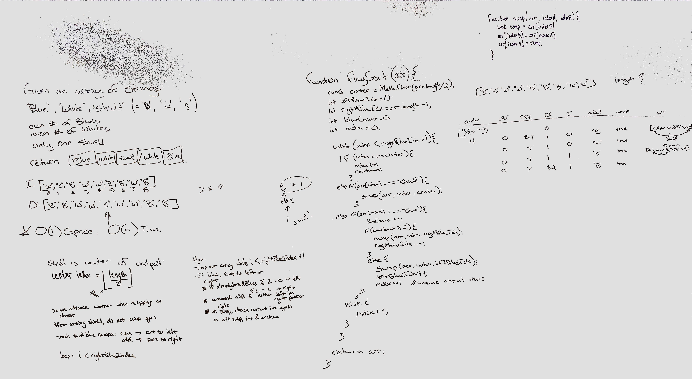

# Flag Sort

Given an array with string elements with the following conditions, sort the array according the pattern.
Element possibilities: "Blue" (any even number), "White" (any even number), "Shield" (one)
Array pattern: ["Blue", "White", "Shield", "White", "Blue"]

## Approach & Efficiency

- Using the partition sorting method from Quicksort, sort the array in a single pass. This method should be O(n) time, where n is the number of elements in the array.
- Use an `index` pointer, a pointer for the right-side blues, and a pointer for the left-side blues.
  - Alternate sorting the blue to the left and the right according to the number of blues that have been sorted.
  - White should not be sorted, as it is basically a filler element.
  - Shield element should be sorted to center when encountered, then not sorted again (skip over the center element when sorting, because it gets sorted as a special case)
  - Advance the `index` only when skipping a white element or when sorting a blue element into the left partition.
    - This needs to happen because everything before the `index` (to the left) is already sorted, so swapping a blue element into the left partition effectively shifts the sorted white elements to the right.
    - Sorting an element into the right partition decrements the ending index, and so decreases the remaining number of elements to sort by 1.

## Solution

