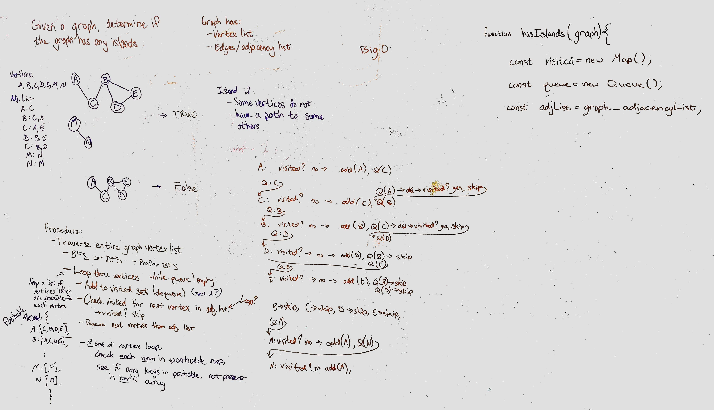

# Graph Islands

Given a graph as input, write a function to determine if there are any islands.

## Approach & Efficiency

- This is for a graph with undirected edges
- Traverse the entire graph, BFS
  - Queue the first vertex
  - For each vertex in the graph (while there are vertices on the queue)
    - Add the vertex to a visited Map with current vertex as key
    - Add the graph's connected vertices as value, use a set
    - Queue the vertex's neighbors, sequentially, only if they have not been visited
    - If a vertex is encountered that is not present in any of the visited vertices' connected sets, this is an island -> increment disjoint segment count, which starts at 0 (first vertex will satisfy this condition, so all graphs will have at minimum one disjoint segment)

## Solution

