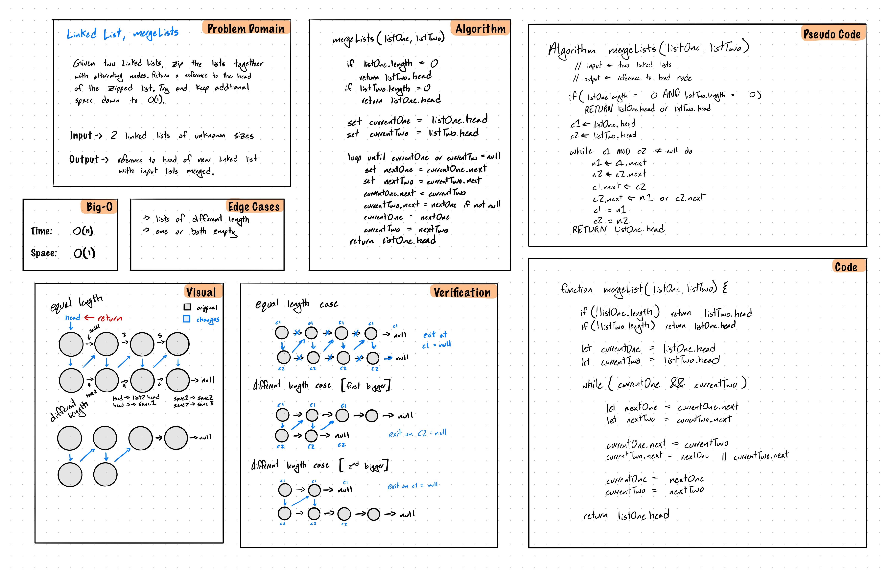

# mergeLists
This is a function takes two linked lists and merges them together, alternating sequentially between the lists. It returns the head node of the resulting list.

## Challenge
Write a function called mergeLists which takes two linked lists as arguments. Zip the two linked lists together into one so that the nodes alternate between the two lists and return a reference to the head of the zipped list. Try and keep additional space down to O(1). You have access to the Node class and all the properties on the Linked List class as well as the methods created in previous challenges.

## Approach & Efficiency
### This is an in-place modification
- Starting with the head of the first list, loop through for as long as the shortest list (loop ends when we try to work with a null node).
- Keep a reference (n1 and n2) inside the loop to both top and bottom nodes that we used to enter the loop.
- Latch the next references, list1 to list2, list2 to n1.next, which was kept from before

### Efficiency
- Time: O(n), Space: O(1);

## Solution

# Collaborators
- Chris Kozlowski
- Rebecca Peterson
- Jagdeep Singh
