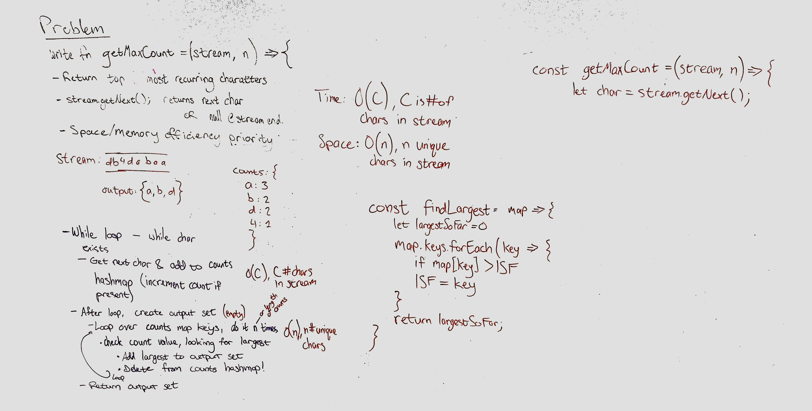

# n Most Frequent Characters

This is a function which uses the binary search algorithm to find an element in a sorted numerical array.

## Challenge

Write a function which takes in a stream of characters and a parameter, n, and returns the n most frequent characters in the stream
Make this the most space efficient implementation

## Approach & Efficiency

- Use a while loop to continue while there are characters to get in the stream
  - Add character to counts hashmap (increment value if already present)
  - Get next character
    - Consider what might happen if the stream doesn't end. Perhaps go piece by piece until a certain number of characters have been read, then send the batch to another function and continue taking in characters.
- After the loop, create an output set
  - Loop `n` times
    - In each iteration, loop over the contents of the counts map, checking for the largest count
    - Add that item to the output set
    - Delete the item from the counts hashmap
- Return the output set

### Efficiency

- Time: O(c), where c is the number of characters in the stream
- Space: O(n), where n is the number of unique characters to return

## Solution

