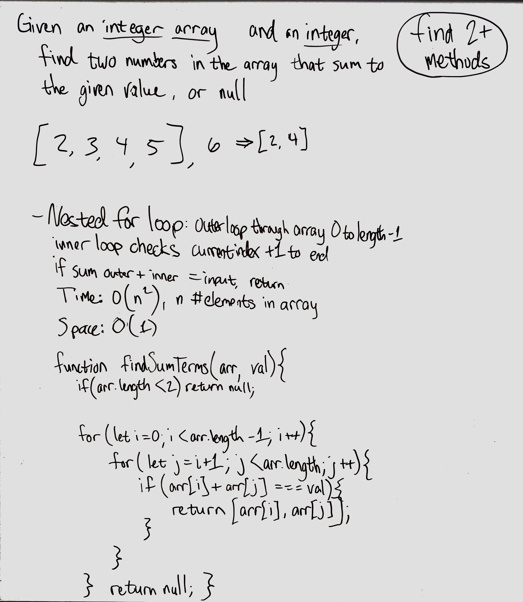

# Find Two Terms - multiple
Given an integer array and an integer, check if there are two numbers in the array which sum to equal the given value.

## Challenge
Work on at least two different ways to do this.

## Approach & Efficiency
### Approaches
- Brute-force approach - check each pair of elements in the array with nested loops.
- Use a hashmap to 

### Efficiency
- Brute-force
    - Time: O(n^2), where n is the length of the array
    - Space: O(1)

## Solution

