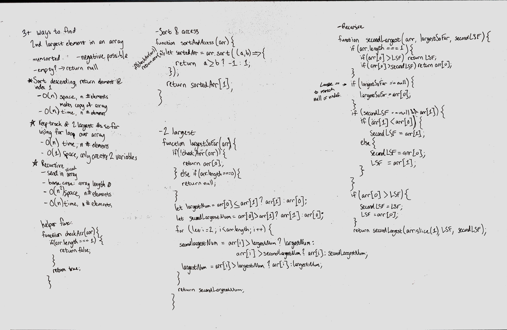

# Second Largest In An Array - multiple
Find at least three different ways to find the second largest number in an array.

## Challenge
Work on at least three different ways to find the second largest number in an array. Maybe use different data structures or methods to do this.

## Approach & Efficiency
### Approaches
- Sort & Access
    - Sort the array in descending order, then access the second element of the array. This is not the most efficient (pretty inefficient, actually), and it does not take into account if there are duplicate values in the array for the largest number. In those cases, this method will return the largest value in the array... not ideal.
- Recursive
    - Initial conditions:
        - if largest and secondLargest are null, compare element 0 and 1 of the array to see which is larger, and store accordingly in the variables
    - Base case: when there are 2 elements in the array, because arrays with fewer elements can't be compared.
        - check the last element only because the first element has been checked already
        - if element > largestSoFar, set largestSoFar <- 
        - if element > secondLargestSoFar and is < largestSoFar, set 
    - Recursive case:
        - Check if element is greater than largestSoFar. If yes, set secondLargestSoFar <- largestSoFar and set largestSoFar <- element
        - Check if number is less than largestSoFar and greater than secondLargestSoFar, which is the only time we update only secondLargestSoFar.
- Looping
    - Set a couple variables outside the for loop and compare the first two elements in the array
    - Use a for loop, from index 1 to the end (already checked index 0 when creating the variables outside the loop)
    - Check if element is > largest, if yes set largest <- element
    - Check if element is > secondLargest and < largest; if yes set secondLargest <- element.
    

### Efficiency
- Sort & Access
    - Time: O(n lg n), n is the # of elements
    - Space: O(n), n is the # of elements
- Recursive
    - Time: O(n), n is the # of elements
    - Space: O(n^2), is the # of elements
- Looping
    - Time: O(n), n is the # of elements
    - Space: O(1), n is the # of elements

## Solution

# Collaborators
- Jagdeep Singh
