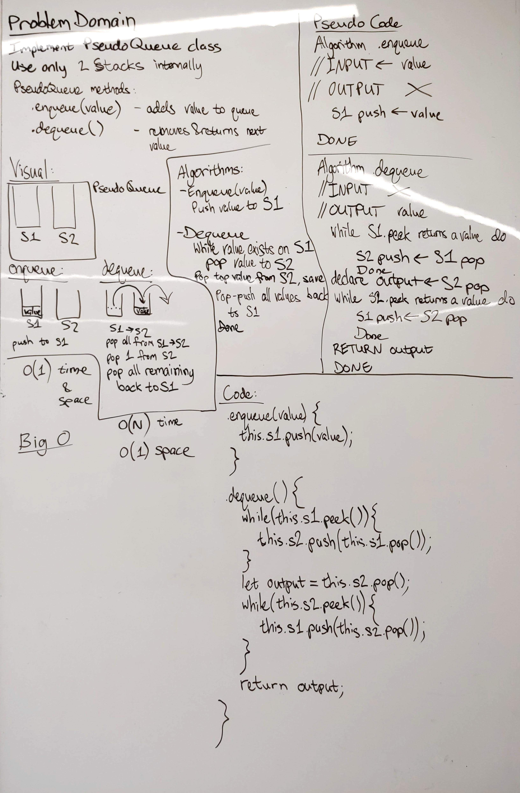

# PseudoQueue
This PseudoQueue class is a queue implemented only with LIFO stacks

## Challenge
Create a brand new PseudoQueue class. Do not use an existing Queue. Instead, this PseudoQueue class will implement our standard queue interface (the two methods listed below), but will internally only utilize 2 Stack objects. Ensure that you create your class with the following methods:

- `enqueue(value)` which inserts value into the PseudoQueue, using a first-in, first-out approach.
- `dequeue()` which extracts a value from the PseudoQueue, using a first-in, first-out approach.
- The Stack instances have only `push`, `pop`, and `peek` methods. You should use your own Stack implementation. Instantiate these Stack objects in your PseudoQueue constructor.

## Approach & Efficiency
Internal configuration of the PseudoQueue class has two stacks, S1 and S2. S1 s the "in" stack and S2 is the "out" 
stack.
### Enqueue
- Push the provided value onto S1.
- Time: O(1)
- Space: O(1)

### Dequeue
- Check if S2 is empty. If it is, loop for as long as S1 has a value on top, and pop that value off S1, push it to S2.
- Pop the top value from S2 and return it.
- Time: O(1)* (Occasionally O(n) when moving data from S1 to S2)
- Space: O(1)

## Solution

