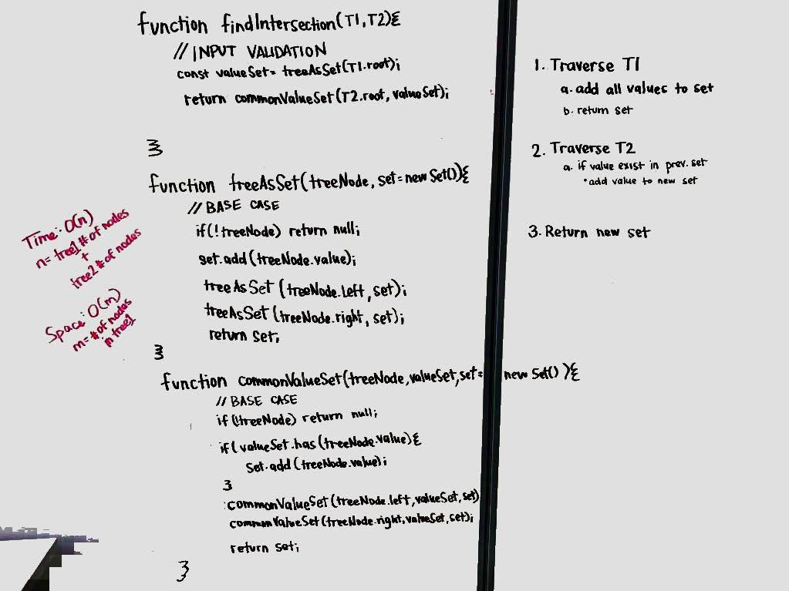

# Binary Tree Intersection

Given two binary trees, find the values that are shared between both trees.

## Challenge

- Write a function called `treeIntersection` that takes two binary tree parameters.
- Without utilizing any of the built-in library methods available to your language, return a set of values found in both trees.

## Approach & Efficiency

- Traverse one tree and build a set from the values
- Traverse the second tree and check each node for presence in the first set. If found, add to an output set.

## Solution

